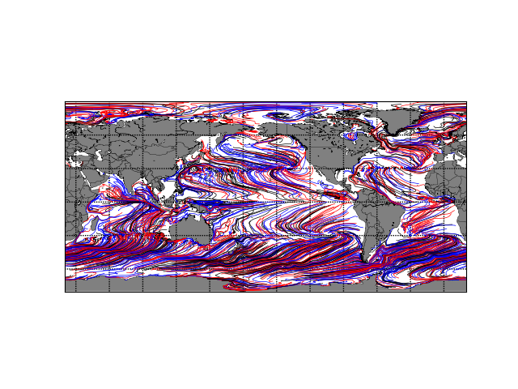
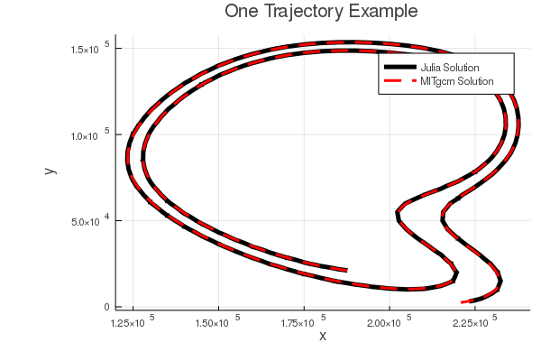

# IndividualDisplacements.jl

[](https://travis-ci.org/gaelforget/IndividualDisplacements.jl)
[](https://gaelforget.github.io/IndividualDisplacements.jl/stable)
[](https://gaelforget.github.io/IndividualDisplacements.jl/dev)
[](https://zenodo.org/badge/latestdoi/208676176)

**IndividualDisplacements.jl** computes individual displacments of elementary points over a gridded model domain. It can also read / write them from / to file. A typical application is the simulation and analysis of materials drifting or moving over the Global Ocean (e.g. plastics or planktons) or Atmosphere (e.g. dust or chemicals). Inter-operability with popular climate model grids and [MeshArrays.jl](https://github.com/gaelforget/MeshArrays.jl) is an important prospect. `IndividualDisplacements.jl ` was initially designed in relation to [MITgcm](https://mitgcm.readthedocs.io/en/latest/?badge=latest), [ECCOv4](https://eccov4.readthedocs.io/en/latest/) ([Forget et al. 2015](https://doi.org/10.5194/gmd-8-3071-2015)), and [CBIOMES](https://cbiomes.readthedocs.io/en/latest/) model simulations.

**Note:** This package is in early development stage and expected to undergo major changes, additions, etc in the near future. It is far from full-featured.



### Installation

```
using Pkg
Pkg.add("IndividualDisplacements")
Pkg.test("IndividualDisplacements")
```

### Use example

To reproduce results from the MITgcm fortran implementation:

```
#import code and data:
using IndividualDisplacements

if !isdir("flt_example")
    run(`git clone https://github.com/gaelforget/flt_example`)
end

#add example:
p=dirname(pathof(IndividualDisplacements))
include(joinpath(p,"examples.jl"))

#run example:
ex_2()
```




